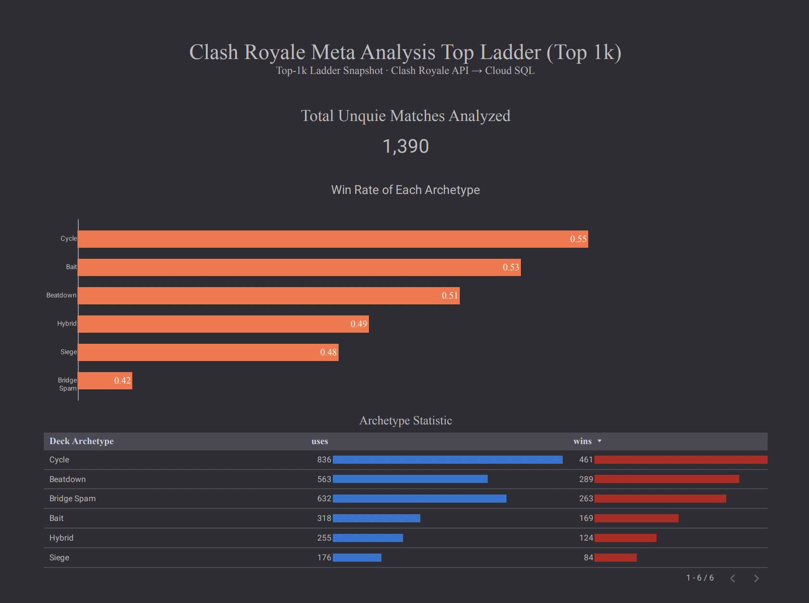
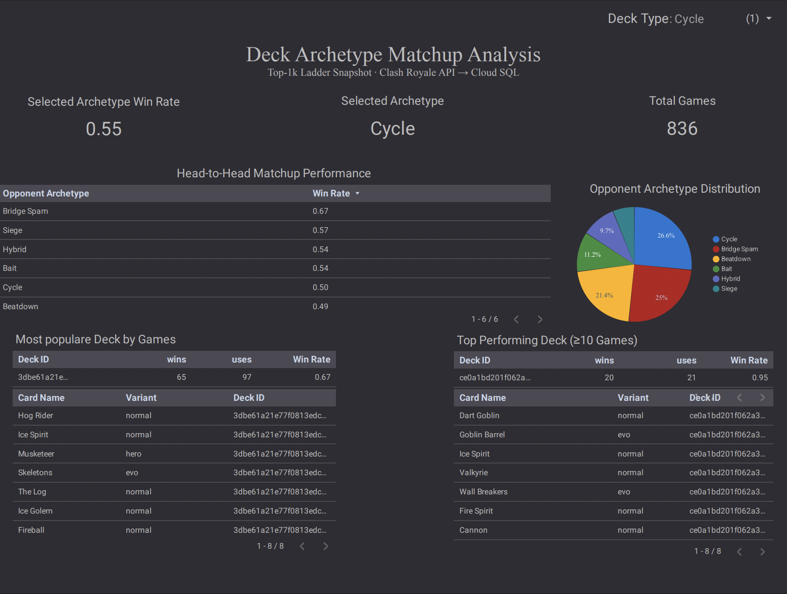

# Clash Royale Top1K Meta Snapshot Warehouse (Postgres)

A data engineering / analytics project that ingests the Top 1,000 global ladder from the official Clash Royale REST API, normalizes and cleans the data, and loads it into a queryable Postgres schema designed for meta analysis:

- Which **deck types** are most played?
- What are their **win rates**?
- How do **deck types match up** vs each other?
- Which **cards** appear most often within each archetype?

This project runs in **snapshot mode** (TRUNCATE + RELOAD) so each refresh produces a clean, consistent “current meta” dataset.

---

## Features

- **Top 1,000 ladder ingestion** from Clash Royale official API
- **Single-run ETL** (Python) to extract → clean → transform → load
- **Analytics-ready Postgres schema** (dimensions + relationship/fact tables)
- Tracks **uses** and **wins**
- Aggregations for:
  - deck type meta usage
  - deck type card usage
  - deck type vs deck type matchup matrix
- **Dockerized local Postgres** for development
- **Google Cloud SQL (Postgres)** publishing so dashboards / Looker Studio can query directly
- **Makefile workflow** for one-command refresh + publish

---

## Tech Stack

- **Python** (ETL)
- **PostgreSQL**
- **Docker / Docker Compose** (local database)
- **Google Cloud SQL (Postgres)** (hosted warehouse)
- **SQL** (schema + analysis queries)
- **Looker Studio** (for easy clean visualization)

---

## Project Workflow (High Level)

1) **Extract**  
   Pull Top 1,000 players + relevant battle/deck data from the Clash Royale REST API.

2) **Transform**  
   Clean and normalize entities:
   - Players
   - Cards (their variants)
   - Decks (canonical 8-card signature → `deck_hash`)
   - Deck archetypes (`deck_type`)
   - Relationship tables for usage/wins and matchup analysis

3) **Load**  
   Load into Postgres using a schema designed for analytics and joins.

4) **Publish (optional)**  
   Copy the local snapshot into Cloud SQL Postgres so it’s queryable externally (e.g., Looker Studio).

---

## Schema Overview

This warehouse is organized around a few core **dimensions** and several **relationship / analytics tables**.

### Dimensions
- `player`  
  One row per player in the Top 1,000 snapshot.
- `cards`  
  One row per card (`card_id`, `card_name`).
- `decks`  
  One row per unique deck (`deck_hash`) + a labeled `deck_type`.
- `deck_types`  
  List of archetype names (e.g., Log Bait, LavaLoon, etc.)

### Relationship / Analytics Tables
- `deck_cards`  
  Deck composition (8 rows per deck_hash, one per card slot).
- `player_decks`  
  Per-player deck usage + wins (player ↔ deck).
- `meta_deck_types`  
  Aggregate usage + wins per deck type (type-level meta).
- `meta_type_cards`  
  Aggregate card usage + wins inside each deck type.
- `meta_type_matchups`  
  Deck-type vs deck-type matchup matrix with uses + wins.
- `meta_type_deck_ids`  
  Rollup mapping of deck hashes into their deck types (with usage/wins).
- `deck_type_overrides`  
  Manual override mechanism: force a specific deck_hash to be labeled as a chosen `deck_type`.

### ER Diagram
The schema was designed up-front as a relationship model (Mermaid → exported diagram).


> Note: This repo uses snapshot mode, so tables represent the latest refresh state.

---

## Getting Started (Local)

### Prereqs
- Docker + Docker Compose
- Python 3.x
- Clash Royale API token (set in `.env`)

### Setup
1) Create `.env` from the .env.example

### Start Postgres + apply schema + upload it into the cloud
```bash
make refresh #turn on docker, create schema, and call etl
make cloud-publish #send local version into the cloud
```
### Dashboard from Google Looker Studio using the sql Data
Relationship Diagram:




